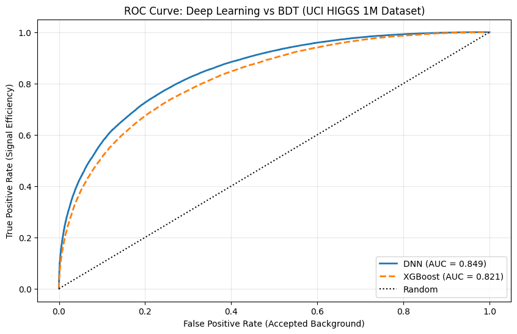
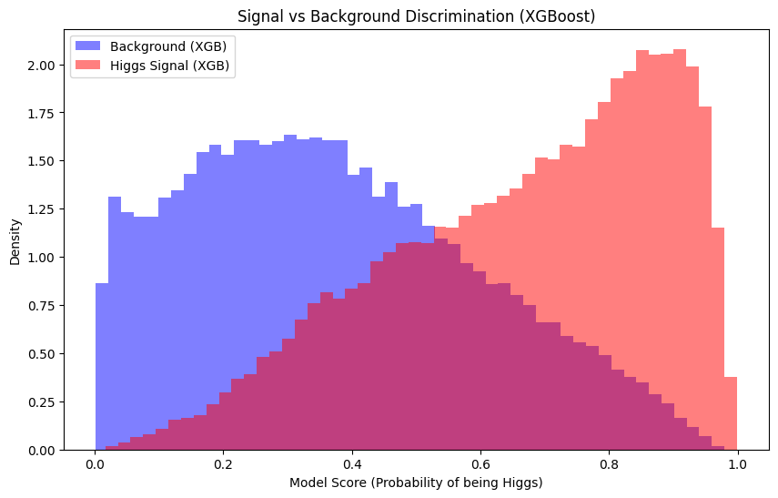
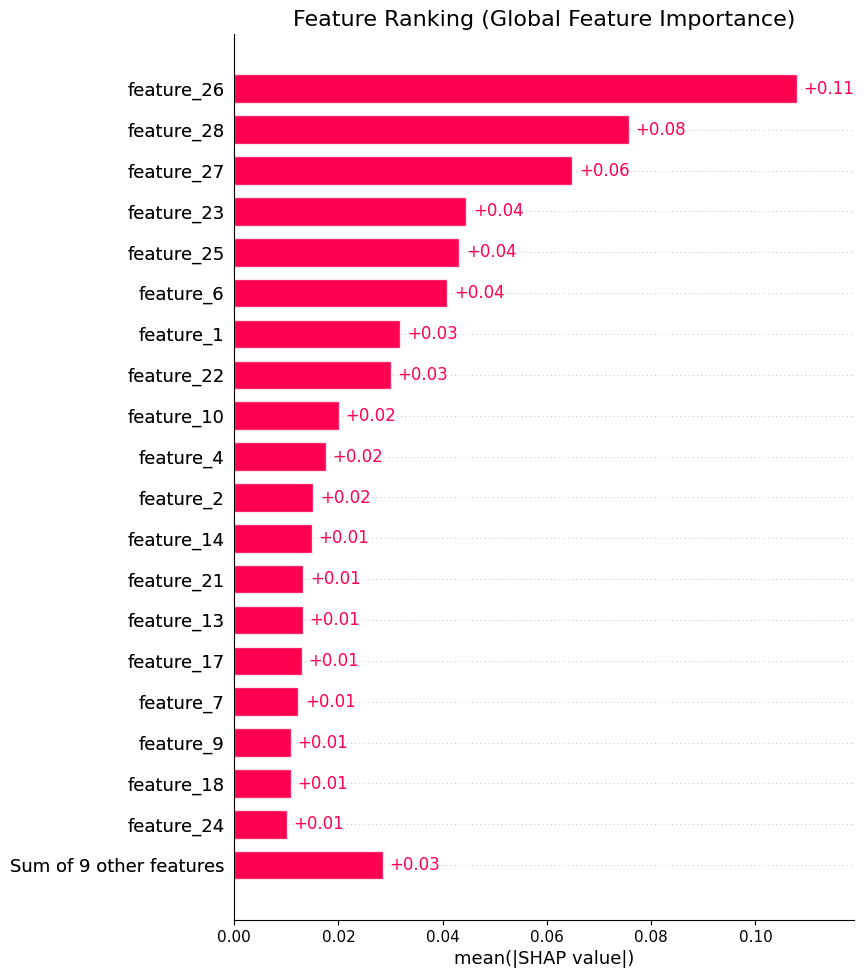

# Higgs Boson Classification: DNN vs XGBoost Benchmark & SHAP Analysis


## 🔬 Project Overview
This project aims to reproduce and validate the application of Deep Learning in High Energy Physics (HEP), specifically for the classification of Higgs Boson decay events vs. Background noise.

Inspired by the seminal paper **"Searching for Exotic Particles in High-Energy Physics with Deep Learning" (Baldi et al., 2014)**, this repository benchmarks a **Deep Neural Network (DNN)** against the industry-standard **XGBoost (BDT)**.

Beyond raw performance metrics, this project focuses on **Explainable AI (XAI)**. Using SHAP values, we open the "black box" to verify if the model's decisions align with the Standard Model of particle physics.

> 🎓 *The inspiration for this reproduction work stemmed from a Master's degree course assignment.*

> **Student:** Lídia Gabrielly Dutra de Meneses Santos 🇧🇷

## 📂 Dataset
The data is sourced from the **UCI Machine Learning Repository**:
* **Dataset:** HIGGS
* **Source:** [UCI Repository Link](https://archive.ics.uci.edu/ml/datasets/HIGGS)
* **Size:** 11 million events (sampled 1M for this study).
* **Features:** 28 kinematic features (21 low-level detector hits + 7 high-level physics derived features).

## 🛠️ Methodology

### 1. Preprocessing
* Stratified sampling to maintain signal/background ratio.
* Standard Scaling ($z = (x - \mu)/\sigma$) applied to all kinematic variables to ensure DNN convergence.

### 2. Models Architecture
* **Baseline (XGBoost):** Gradient Boosted Decision Trees, traditionally the gold standard in HEP analysis.
* **Deep Neural Network (DNN):**
    * Input Layer: 28 features.
    * Hidden Layers: 4 dense layers (300 neurons each) with ReLU activation.
    * Regularization: Batch Normalization + Dropout (0.3).
    * Optimizer: Adam with Learning Rate Decay.

## 🏆 Performance Results

| Model | AUC-ROC Score |
| :--- | :--- |
| XGBoost (Baseline) | 0.8213 |
| **Deep Neural Network (Ours)** | **0.8505** |

<p float="left">
  
  
</p>

The DNN demonstrates superior signal efficiency for a given background rejection rate compared to the BDT baseline.

## ⚛️ Physical Interpretation & Discussion
A critical aspect of applying AI to physics is ensuring the model relies on physical phenomena rather than artifacts. We employed **SHAP (SHapley Additive exPlanations)** to rank feature importance.

<div align="center">
  
</div>

## 📋 Dataset Features Description

The dataset consists of **28 kinematic features** derived from particle collision events. These features are divided into two categories:

1.  **Low-Level Features (Index 1-21):** Raw measurements from the particle detector (momenta, angles, and b-tagging scores).
2.  **High-Level Features (Index 22-28):** Variables derived by physicists using theoretical principles to specifically target the Higgs Boson decay topology ($H \to \tau\tau$ and $H \to b\bar{b}$).

| Index | Feature Name | Type | Physical Meaning |
| :---: | :--- | :--- | :--- |
| **1** | `lepton pT` | Low-Level | Transverse momentum of the lepton produced in the decay. |
| **2** | `lepton eta` | Low-Level | Pseudorapidity ($\eta$) of the lepton (angle relative to the beam axis). |
| **3** | `lepton phi` | Low-Level | Azimuthal angle ($\phi$) of the lepton. |
| **4** | `missing energy magnitude` | Low-Level | Energy imbalance in the transverse plane (indicates undetected particles like neutrinos). |
| **5** | `missing energy phi` | Low-Level | Azimuthal angle of the missing transverse energy. |
| **6-8** | `jet 1 (pt, eta, phi)` | Low-Level | Kinematics of the leading jet (stream of hadrons). |
| **9** | `jet 1 b-tag` | Low-Level | Probability score that jet 1 originated from a bottom quark ($b$). |
| **10-12**| `jet 2 (pt, eta, phi)` | Low-Level | Kinematics of the second jet. |
| **13** | `jet 2 b-tag` | Low-Level | b-tagging score for jet 2. |
| **14-16**| `jet 3 (pt, eta, phi)` | Low-Level | Kinematics of the third jet. |
| **17** | `jet 3 b-tag` | Low-Level | b-tagging score for jet 3. |
| **18-20**| `jet 4 (pt, eta, phi)` | Low-Level | Kinematics of the fourth jet. |
| **21** | `jet 4 b-tag` | Low-Level | b-tagging score for jet 4. |
| **22** | `m_jj` | **High-Level** | Invariant mass of the two jets with the highest b-tag scores. |
| **23** | `m_jjj` | **High-Level** | Invariant mass of the three jets with the highest b-tag scores. |
| **24** | `m_lv` | **High-Level** | Invariant mass of the lepton and the missing energy (neutrino). |
| **25** | `m_jlv` | **High-Level** | Invariant mass of the leading jet, lepton, and neutrino. |
| **26** | `m_bb` | **High-Level** | Invariant mass of the bottom quark pair. **(Critical for Higgs identification)** |
| **27** | `m_wbb` | **High-Level** | Invariant mass of the $W$ boson and two bottom quarks. |
| **28** | `m_wwbb` | **High-Level** | Invariant mass of the $WWb\bar{b}$ system. |

> **Note:** The dominance of high-level features (especially `m_bb` at index 26) in the SHAP analysis confirms that the Deep Neural Network successfully learned the underlying physics of the Standard Model to distinguish signal from background.

### Analysis
The analysis confirms the model's physical consistency:
1.  **Invariant Mass Dominance:** The features $m_{bb}$ (mass of bottom quark pair) and $m_{wwbb}$ emerged as the top predictors. This aligns with theoretical expectations, as invariant mass is the primary kinematic handle for identifying resonance decays ($H \to b\bar{b}$).
2.  **Model Validation:** The network autonomously "rediscovered" high-level physics concepts from the training data without being explicitly programmed with the Standard Model equations.

## 🚀 How to Run
1.  Clone this repository:
    ```bash
    git clone https://github.com/lidia-gab1/higgs-boson-ml-benchmark.git
    ```
2.  Install dependencies:
    ```bash
    pip install -r requirements.txt
    ```
3.  Run the Jupyter Notebook in `notebooks/`.

## 📚 References & Inspiration
This work is a reproduction study based on the dataset and concepts presented in:

> **[1] Baldi, P., Sadowski, P., & Whiteson, D. (2014). "Searching for exotic particles in high-energy physics with deep learning." *Nature Communications*, 5, 4308.**

Additional references used for XAI validation:
> [2] Lundberg, S. M., & Lee, S. (2017). "A unified approach to interpreting model predictions." *NeurIPS*.

## 📄 License
This project is licensed under the MIT License - see the LICENSE file for details.
